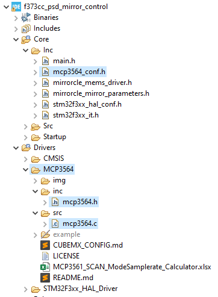

# Libraries

---

Libraries usually serve as abstraction layer / wrapper for various chips and their configuration. 
The following notes serve to help easy understanding and efficient integration of libraries.

## How to set up a Library

A library consists of 3-4 parts:
- Source Code (`/src`)
- Include / Header Files (`/inc`)
- User Config Files (`mylib_conf.h`)
- Example Project (`/example`)

These files must be placed in separate directories because it is easier to include the directories in a project afterwards.



`/inc` is the directory that is added to the Include Path in the Project Settings. 
The user config files do not belong in this folder, because it is inside the library and thus the Git repository.
Any changes made in the user config should not be subject to the library's version management.

`/src` contains all compilable source files.

`/example` can contain sample code. 
The whole directory can be excluded from the compilation process using _"Resource Configurations > Exclude from Build"_.
A disadvantage of having an example in a library is that STM32CubeIDE will open all `main.c` files during code configuration - even if the example is excluded from the build.
This may lead to confusion when multiple `main.c` files are open.

The library can provide a **user config file** as template / example on the top level. 
This is then copied into the `/Inc` directory of the project.


## Libraries as Submodules

If the above rules are followed, libraries can be embedded as separate Git repositories in a new project repository. That is, both are independent projects and changes in the library can be applied to the project via Git commands. This method is called git submodules.
The following commands are important:

```bash
# adding a submodule
mkdir Drivers/MCP3564
git submodule add git@github.com:fhnw-ise-qcrypt/mcp3564.git Drivers/MCP3564
```

```bash
# updating submodules after a fresh clone of the full project
git submodule update --recursive –remote
```

